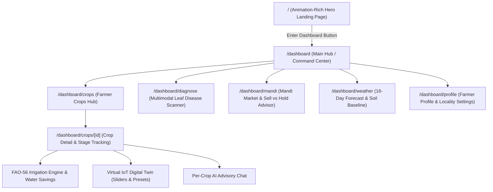

# 🌾 FasalMitra (AgroSmart) — Architecture & Site Map Plan

This document records the user-approved navigation flow, visual hierarchy, and module routing for FasalMitra.

---

## 🗺️ Visual Site Map & Navigation Architecture

---

## 🧭 Page-by-Page Functional Breakdown

### 1. Landing Page (`/`)
- **Nature**: Pure introductory, visual & animation-rich showcase (no daily operational work).
- **Features**:
  - Hero banner with smooth micro-animations, glassmorphism cards, dynamic agricultural visual effects.
  - Interactive teaser of the 4 core pillars:
    1. *FAO-56 Smart Irrigation & Water Conservation*
    2. *Virtual LoRaWAN Soil Probe Digital Twin*
    3. *Dual-Engine AI Agronomist Consultation (Hindi, Marathi, English, etc.)*
    4. *APMC Mandi Intelligence & Cold Storage Financial Advisor*
  - **Primary CTA**: Prominent, glowing **"Enter Dashboard"** / **"शुरू करें"** button navigating directly to `/dashboard`.

---

### 2. Main Dashboard Hub (`/dashboard`)
- **Nature**: Central command cockpit for the farmer.
- **Features**:
  - Farmer greeting with live weather snippet & regional soil baseline badge.
  - **Active Crops Overview Carousel / Cards** (showing growth stage progress %, soil moisture indicator, and harvest countdown).
  - **Today's Irrigation Action Banner** (e.g. `💧 SKIP Irrigation — Rain Forecasted (18.4 mm)` with Liters saved counter).
  - **Quick Action Dock**: Instant access to Crop Manager, Disease Scanner, Mandi Trends, and AI Chat.

---

### 3. Crop Hub & Detail View (`/dashboard/crops` & `/dashboard/crops/[id]`)
- **Add Crop Modal**: Search from 32+ master catalog crops, specify acreage, sowing date, and irrigation source.
- **Crop Detail View**:
  - Visual Growth Timeline (from *Sown* $\rightarrow$ *Vegetative* $\rightarrow$ *Flowering* $\rightarrow$ *Harvest*).
  - **FAO-56 Irrigation Card**: Daily water requirement in mm, rain forecast check, and water saved in Liters.
  - **Virtual IoT Digital Twin Probes**: Interactive sliders for Soil Moisture %, NPK, pH, Soil Temp, and EC + 1-Click Simulation Presets (`DROUGHT`, `MONSOON`, `NUTRIENT_DEPLETION`, `OPTIMAL`, `SALINITY_SPIKE`, `ACIDIC_SHOCK`).
  - **Agronomic Health Score Gauge**: Real-time 0–100 health score with deficiency/toxicity alerts.

---

### 4. Per-Crop AI Agronomist (`/dashboard/crops/[id]/chat` or Integrated Drawer)
- Context-injected multilingual chat (English, Hindi, Marathi, Punjabi, Telugu, Tamil).
- Structured prescription pills (fertilizer dosing tailored to field acreage, irrigation advice, cultural tips).

---

### 5. Leaf Disease Vision Scanner (`/dashboard/diagnose`)
- Drag-and-drop / Camera capture leaf photo uploader.
- Gemini 3.6 Flash Vision pathology analysis with confidence score %, symptoms breakdown, organic remedies, and chemical controls.

---

### 6. Mandi Market Intelligence (`/dashboard/mandi`)
- 30/60/90-day APMC price trend charts.
- **"Sell Now vs. Store & Wait" Financial Decision Card** with cold storage fee calculator and net profit % projections.

---

### 7. Farmer Profile & Location Settings (`/dashboard/profile`)
- Locality configuration (Village, District, State, Lat/Lon).
- Auto-synced Kaegro soil baseline inspector.
- Multi-language preference selector.

---

*Site map saved and ready for frontend implementation instructions.*
